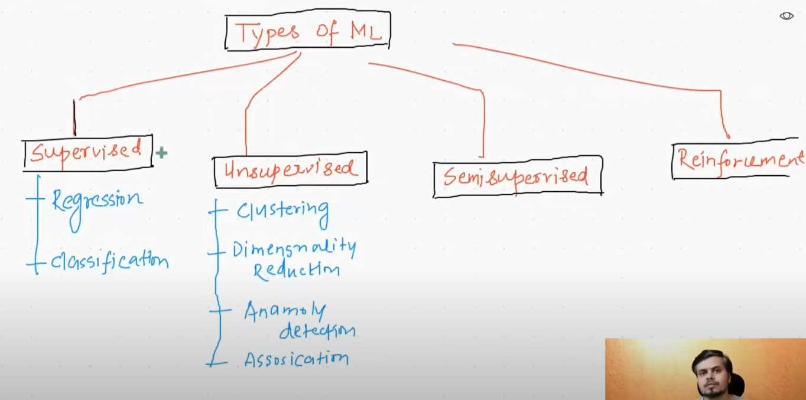
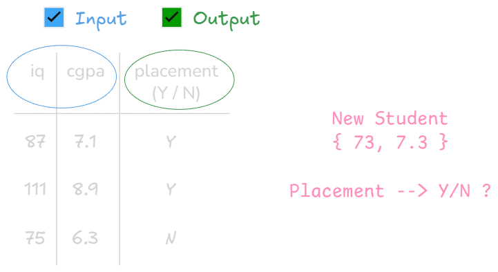
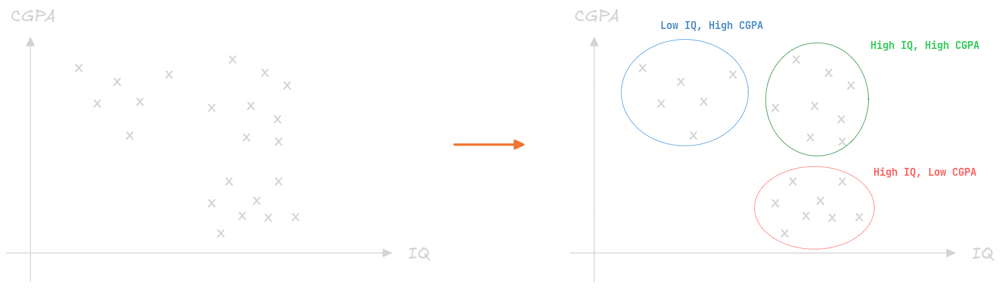
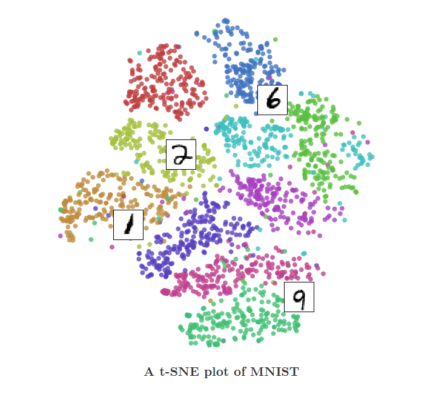
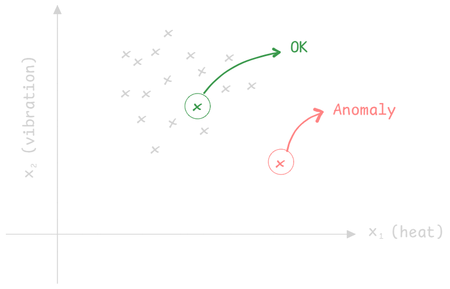

# L03 - Types of Machine Learning

    

Machine learning types depend on various factors. This video focuses on categorization based on the **amount of supervision needed** for Machine Learning algorithms to get trained.

Based on the amount of supervision, ML algorithms can be divided into four main categories:

-   **Supervised Machine Learning**
-   **Unsupervised Machine Learning**
-   **Semi-Supervised Machine Learning**
-   **Reinforcement Learning**

## 1. Supervised Machine Learning

-   **Concept**: Learning from data where both **input** and **output** are available, and the goal is to find a relationship between them to predict output for new inputs.
-   **Example**: Predicting student `placement` (output: Yes/No) based on `IQ` and `CGPA` (inputs).
    -   The model learns the relationship between `IQ`, `CGPA`, and `placement` status.
    -   For a new student's `IQ` and `CGPA`, it can predict `placement`.

-   **Data Types**: Understanding data types is crucial for learning the sub-types of Supervised ML. There are two kinds of data:

    -   **Numerical Data**: Measurable quantities (e.g.: `age`, `weight`, `CGPA`, `IQ`, `salary` / `package`).
    -   **Categorical Data**: Data that can be divided into groups (e.g., `gender`, `nationality`, `phone brand`, `placement_status`).

-   **Sub-types of Supervised ML**:

    1.  **Regression**:

        -   **Definition**: A supervised ML problem where the **output column is numerical**.
        -   **Example 1**: Predicting the `package` (salary) a student will get (e.g., 4.5 Lacs, 3.0 Lacs), based on `IQ` and `CGPA`.
        -   **Example 2**: _House Price Prediction_ is another example.

    2.  **Classification**:

        -   **Definition**: A supervised ML problem where the **output column is categorical**.
        -   **Example 1**: Predicting `Placement` (Yes/No) based on `IQ` and `CGPA`. This was the initial example provided.
        -   **Example 2**: Detecting if an email is `spam` or `not spam`.
        -   **Example 3**: Predicting if it will `rain` or `not rain` based on weather conditions.
        -   **Example 4**: Identifying if an image contains a `dog` or `not a dog.`

## 2. Unsupervised Machine Learning

-   **Concept**: Involves data where **only input** data is available, and there is **no output** or target variable. The goal is to find hidden patterns or structures within the data itself.
-   **Example**: Having student data with only `IQ` and `CGPA`, but no information about `placement`. Here, prediction of an output is not possible.
-   **What it does**: Explores the underlying structure of the data. Either you do **Clustering** or **Dimentionality Reduction** or **Anamoly Detection** or **Association Rule Learning**.

-   **Sub-types of Unsupervised ML**:

    1.  **Clustering**:

        -   **Definition**: Grouping similar data points together into `clusters` or categories. The algorithm discovers these groups on its own.
        -   **Example 1**: Grouping students based on their `IQ` and `CGPA`, identifying groups like `high IQ, high CGPA` or `high IQ, low CGPA` etc.

            

        -   **Example 2**: Customer segmentation in e-commerce, dividing customers into groups based on their behavior or preferences.
        -   **Benefit**: Helps in understanding different categories within unlabeled data and processing them accordingly.

    2.  **Dimensionality Reduction**:

        -   **Definition**: Reducing the number of input columns (dimensions) in a dataset while retaining most of the important information.
        -   **Problem Solved**: High-dimensional data (e.g., thousands of input columns in image or text data) can make algorithms run slowly and may not improve results after a certain point.
        -   **Techniques**: Can remove redundant columns or combine multiple columns into a single, more meaningful one (Feature Extraction).
        -   **Example 1 (Feature Extraction)**: Combining `number of rooms` and `number of washrooms` into a single `square footage` column for house price prediction (The algorithm used is **PCA - Principle Component Ananlysis**, will study later).
        -   **Example 2 (Visualization)**: Reducing high-dimensional data (e.g., 784 dimensions (24 x 24) for MNIST handwritten digits) to 2 or 3 dimensions for visualization and studying relationships between points that are otherwise impossible to plot (e.g., using PCA).

            

    3.  **Anomaly Detection**:

        -   **Definition**: Identifying data points that are significantly different from the majority of the data, indicating unusual or suspicious activity.
        -   **Applications**:
            -   **Manufacturing**: Detecting defects in products.
            -   **Finance**: Identifying fraudulent credit card transactions or loan applications.
            -   **Cybersecurity**: Detecting unusual network activity.
        -   **How it works**: Establishes a "normal" range or pattern from existing data and flags any points falling outside this range as anomalies.
            
            

    4.  **Association Rule Based Learning**:

        -   **Definition**: Discovering interesting relationships or "rules" between variables in large datasets. It identifies items that frequently occur together.
        -   **Application**: Market basket analysis.
        -   **Example 1**: In a supermarket, analyzing shopping bills to find that if "milk" is bought, "bread" is also frequently bought. This helps in arranging products side-by-side to increase sales.
        -   **Example 2 (Famous Case Study)**: In a US supermarket (Walmart), analysis showed a correlation between customers buying **baby diapers and beer**. Placing these unrelated products near each other increased sales, as customers buying diapers (often fathers) also tended to buy beer. This highlights hidden patterns machine learning can uncover.

## 3. Semi-Supervised Machine Learning

-   **Concept**: A blend of supervised and unsupervised learning. It uses a **small amount of labeled data** combined with a **large amount of unlabeled data** during training.
-   **Why it's used**: Labeling data (creating output columns) can be very expensive and requires human effort. Semi-supervised learning aims to reduce the need for extensive manual labeling.
-   **How it works**: The algorithm uses the small labeled dataset to learn some initial patterns and then leverages the unlabeled data to further improve its understanding and make predictions or classifications for the rest of the data.
-   **Example**: **Google Photos face recognition**.
    -   The system uses unsupervised techniques (like clustering) to group similar faces in your photos.
    -   It then asks you to label just **one or two photos** for a specific person (e.g., "This is Dad").
    -   Once you provide a few labels, the system automatically labels all other photos in that person's cluster as "Dad," leveraging the small amount of human-provided labels to expand recognition across a large unlabeled dataset.

## 4. Reinforcement Learning

-   **Concept**: A type of ML where an **agent** learns to make decisions by interacting with an **environment**. It receives **rewards** for desired actions and **punishments** for undesired ones, **without any initial data**. The goal is to maximize cumulative reward.
-   **How it works**:
    1.  The **agent** observes its **environment**.
    2.  Based on its **policy** (rule book), it performs an **action**.
    3.  The environment provides **feedback** in the form of a **reward** (positive) or **punishment** (negative).
    4.  The agent updates its policy to learn which actions lead to more rewards and fewer punishments.
    5.  This process of trial and error allows the agent to gradually improve its performance over time.
-   **Analogy**: Like training a dog with chocolates for good behavior and punishment for bad, or how humans learn by making mistakes and adjusting.
-   **Examples**:
    -   **Self-driving cars**: The car (agent) learns to navigate roads (environment) by receiving rewards for reaching destinations safely and punishments for accidents or breaking rules.
    -   **Game playing**:
        -   Teaching a system to play Chess or Go. DeepMind's AlphaGo famously defeated the world champion in Go, a highly complex game, demonstrating the power of reinforcement learning.
        -   The agent learns optimal moves by playing against itself or humans, getting rewards for winning and penalties for losing.

> **Key Takeaway**: Understanding these different types of machine learning is fundamental for solving real-world problems effectively. Each type is suited for different kinds of data and problem statements.
