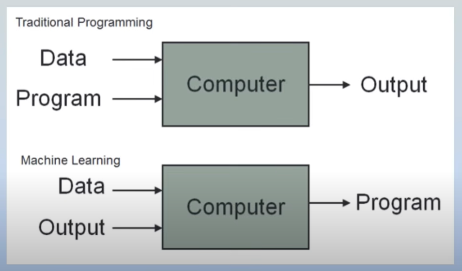

# L01 - What is Machine Learning?

	

## Course Overview

-   End-to-End Machine Learning Playlist
-   ML (Machine Learning) Algorithms as well as ML/Product Lifecycle
-   From basics to entire flow of ML project
-   Focuses more on hands-on. For more in-depth understanding of algorithms you can refer to the individual topic videos on the channel.

## What is Machine Learning?

> Machine Learning is a field of computer science that uses **statistical techniques** to give computer systems the ability to _LEARN_ with data, without being **explicitly programmed**.

**Example:** `Eamil Spam Detection` - In such cases you can not write programs for each spam email. But using Machine Learning Algorithms, it can automatically recognize patterns in the data and generate the spam detection logic for you.

**Example:** `Image Classification` - Can you think of writing a program which can classify images of dogs and cats, you can't do so. Therefore, you need a program which can do exactly what our brains do i.e. identify patterns. And therefore you have to use ML.

**Example:** `Data Mining` - It is a technique which is used for deep analysis of data like why exactly an email is getting into spam, what are the patterns that my ML algorithm has captured that it is classifying that email into spam. For these kind of cases that is Data Mining, we need machine learning.

## History of Machine Learning

ML has boomed recently after 2010. It had started way back, had all the algorithms and maths in place but the problem was it required huge data for processing. And unfortunately to gather and label that ampunt of data was quite tedious. And the second problem was even though you have the labelled data, you didn't have such kind of hardware which can run those algorithms on that data.

Thus, after 2010, the evolution of Internet and Smartphones aided in the boom of machine learning as it solved both the problems. We're generating data in an incredibly astonishing rate - the moment you wake up till you sleep and there are billions of people using the internet, just imagine 🤯.

And coming to the hardware, now as you can see we have 12GB RAM phones in our pocket even GPUs too. For scientists at that time, access to GPU was a big thing.

And from now on the field of machine learning is projected to experience significant growth in the coming years.
