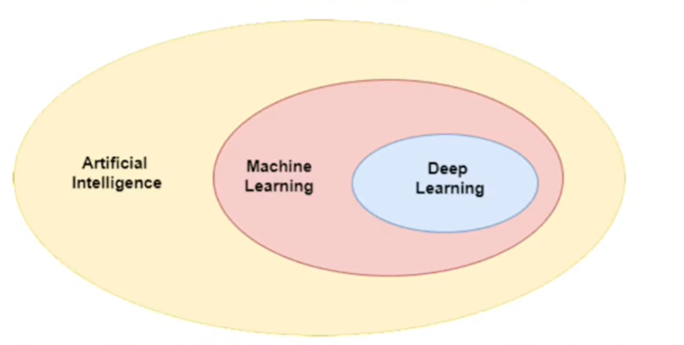
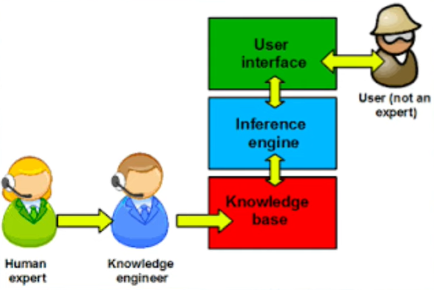
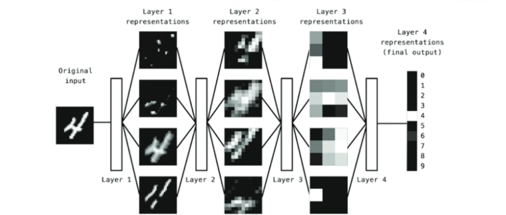
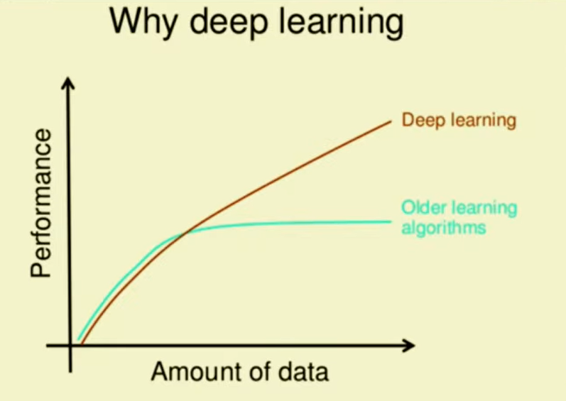

# L02 - AI vs ML vs DL for Beginners

	

## Introduction

**AI** stands for **Artificial Intelligence**, which includes _Pattern Recognition_, _Emotional Intelligence_, _Creativity & Imagination_. And Right now whatever we're seeing is machine learning which is **pattern recognition**.

## History of AI

Initially we had `Symbolic AI` (Knowledge Systems) --> then came `Expert Systems` (Chess Bot). In the early 80s everyone projected that expert systems will become the future of AI. But later people realised that there are flaws in the expert systems - expert systems work on very closed problems (like playing chess).

Next came `Machine Learning`, which was able to solve fuzzy logic based problems, because it learns from the patterns in the data. So, rather than writing rules for everything, just provide data and rules will be generated automatically. This has changed the industry.

Now the next question - if machine learning is able to solve the problem then what is the need of deep learning.

So, lets discuss `Deep Learning` in two phases - What and Why.

Deep Learning is essentially machine learning only - you input the data, train the model and then bring new data and do the prediction, same thing. The only difference is the algorithms used in deep learning are a bit different (inspired by biology - neurons). So, deep learning is basically a mathematical model, it is just that the core unit is built using perceptron which is inspired from biological neuron. And don't get it wrong that it works exactly like our brain, because the way that our brain works is way complex.

Now the question - Why is Deep Learning the buzz word! The reason is that it solves certain problems better than machine learning.

In machine learning you have to provide features, like let say you have to classify dogs & cats images, then you'll have to specify features of dogs & cats. But in the deep learning space the system itself automatically detects these features, and if you're working on fuzzy logic based problems where you don't know what features could actually work for better classifcation, there deep learning can really help in extracting the relevant features.

So, thats the main difference between machine learning and deep learning:

-   In deep learning you don't need to worry about the features, the algorithm automatically captures the essential features.
-   Second is that, increasing the number of layers (making the network "deeper") often leads to better performance (you get deeper insights from the data, example in digit classification each layer tells you different components of the digit - [3Brown1Blue Neural Network Video](https://www.youtube.com/watch?v=aircAruvnKk&t=331s)), especially with large data sets and complex tasks.

However, in traditional machine learning, adding more layers or complexity to a model beyond a certain point can actually decrease accuracy or lead to overfitting.

Therefore, deep learning is heavily being used in image classification tasks, text related tasks, GANs (Generative Adversarial Network).

Then you may ask - If deep learning is so much better then why to use machine learning. It's because you don't use a sword where you just need to tighten nuts and bolts, a screw-driver can do the perfect job. And guess what 90% of the world's data is small data, companies like Meta, Instagram, Youtube - their's data is massive data. But when you start working in industries like banking companies, sports analytics companies etc. they don't have massive data. And Machine Learning can easily give you better results with less resources.

If at this point you're planning to build AI, Machine Learning and Deep Learning is the way to go.
